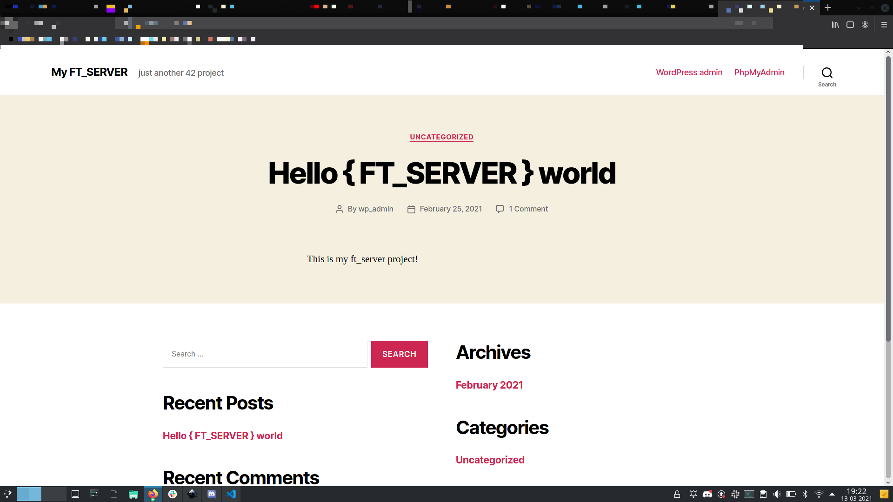

# FT_SERVER 🐳

### 📦 The Docker image includes:

- Nginx
- PHP
- MariaDB SQL database
- PhpMyAdmin
- Wordpress

### Build Docker image

    docker build -t ft_server .

###  Run a container

    docker run -it -p80:80 -p443:443 ft_server

Now you already have access to the container interactive shell. You can also access the server using your browser on localhost.

### Autoindex on/off
 1. run the following command in the interactive shell:

    ``bash /tmp/srcs/autoindex_tester.sh off``

 2. access:
    ``https://localhost/hello/``
    You can't see anything because the autoindex is OFF
 3. run:
   ``bash /tmp/srcs/autoindex_tester.sh on``
 4. access:
   ``https://localhost/hello/``
   Now you're able to see all the directories inside the hello folder.

